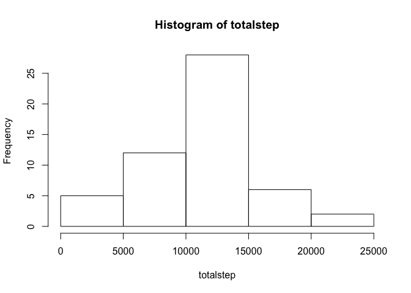
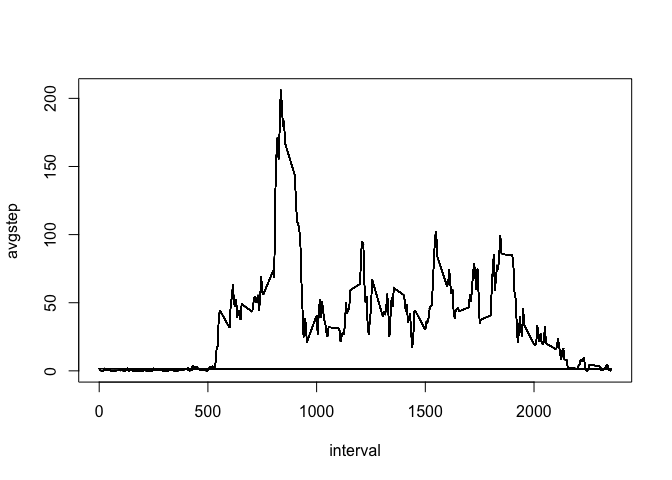
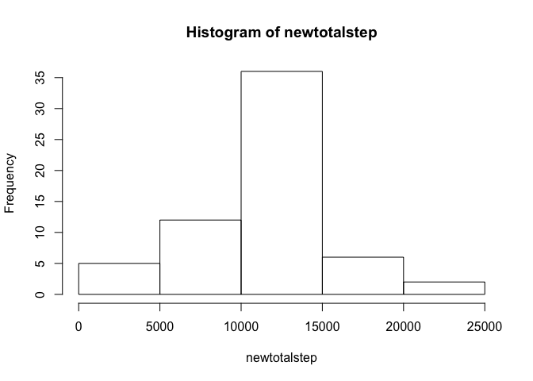
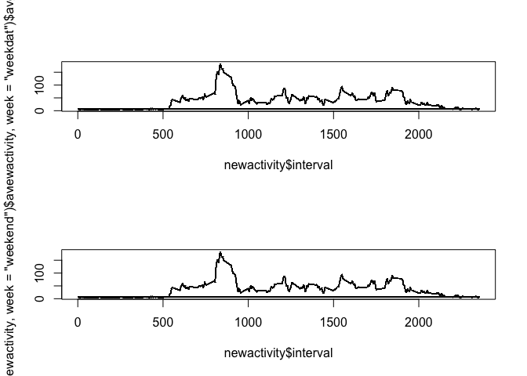

## Loading and preprocessing the data


```r
activity <-read.csv(file="activity.csv")
```

## What is mean total number of steps taken per day?

### Calculation number of step per day

```r
totalstep<-tapply(activity$steps,activity$date,sum)
```

1.Histogram of the total number of steps taken each day


```r
hist(totalstep)
```

<!-- -->

2.Mean and median total number of steps taken per day
 
 ```r
 mean(totalstep,na.rm=TRUE)
 ```
 
 ```
 ## [1] 10766.19
 ```
 
 ```r
 median(totalstep,na.rm=TRUE)
 ```
 
 ```
 ## [1] 10765
 ```
## What is the average daily activity pattern?

### Creating the data frame needed for plot time-series

 a. find average number of step per day for y-axis of plot


```r
avgstep<-tapply(activity$steps,activity$interval,mean,na.rm=TRUE)
```

 b. creating the data frame for ploting with variable avgstep and interval and naming them.

 
 ```r
 datasteps<-data.frame(cbind(avgstep,activity$interval))
 names(datasteps)= c("avgstep","interval")
 ```

 1. make time series plot 
 

```r
with(datasteps,plot(interval,avgstep,type = "l"))
```

<!-- -->

2. maximum number of step for interval 


```r
datasteps[which.max(avgstep),]
```

```
##      avgstep interval
## 104 206.1698      835
```

## Imputing missing values

1. Calculate and report the total number of missing values 


```r
sum(is.na(activity$steps))
```

```
## [1] 2304
```

 2. Devise a strategy for filling in all of the missing values in the datase
 
 

```r
 stratgym<-mean(activity$steps, na.rm = TRUE)
```

 3. Create a new dataset with missing field


```r
newactivity<-activity
newactivity$steps[is.na(activity$steps)] <- stratgym
```

 4. Calculate Histogram,mean,median total number of step per day  for new data.frame

```r
newtotalstep<-tapply(newactivity$steps,newactivity$date,sum)
hist(newtotalstep)
```

<!-- -->

```r
mean(newtotalstep,na.rm=TRUE)
```

```
## [1] 10766.19
```

```r
median(newtotalstep,na.rm=TRUE)
```

```
## [1] 10766.19
```

#### As  we can see the mean is the same as when we didn't substitue the NA variable,
#### but the median has slightly changed. our new median is equall to are mean.

## Are there differences in activity patterns between weekdays and weekends?


1. Create new  variable in the new data set with filled in missing value.


```r
week<-weekdays(as.POSIXlt(activity$date))
week<-ifelse ((week =="Sunday" | week =="Saturday") ,"weekend", "weekday") 
newactivity<-data.frame(cbind(newactivity,week))
```
 2. Make a panel plot containing a time series plot 
 a. build the  new variable avrage step per day
 
 
 ```r
  avgsteptaken<-tapply(newactivity$steps,newactivity$interval,mean,na.rm=TRUE)
  newactivity<-data.frame(cbind(avgsteptaken, newactivity))
 ```
 
 ```
 ## Warning in data.frame(..., check.names = FALSE): row names were found from a
 ## short variable and have been discarded
 ```

 b. two time series graph  for weekday no weekend 


```r
par(mfrow=c(2,1))
plot(newactivity$interval, subset(newactivity,week="weekdat")$avgsteptaken,type = "l") 
plot(newactivity$interval, subset(newactivity,week="weekend")$avgsteptaken,type = "l")
```

<!-- -->


